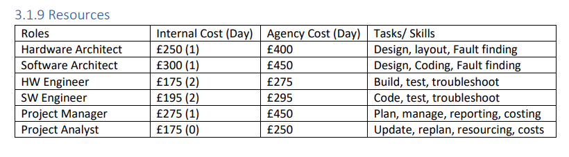

# Synputer Cost Estimator


## Project Overview
This is a piece of software built as part of "Assignment 2 - Presentation" for the Software Engineering Project Management course at the University of Essex Online by Group 1, consisting of:
- Nassar Al-Naimi
- Charles Kuyuyama
- Abdulah Alihu Ngamjeh
- Trevor Woodman

- November 2023

The Synputer Cost Estimator is a command-line tool that takes two .csv files for hardware and software BOM and labour costs, and produces a cost estimate for the unit and labour costs of the project.

It uses a 3-point estimation technique, applied to hardware, software, and testing/QA costs, then combined to give a total cost estimate.
- Optimistic (O): Assumes being ahead of schedule, minimal delays, high efficiency.
- Pessimistic (P): Assumes being behind schedule, most delays, low efficiency.
- Most Likely (M): Assumes being on schedule, average delays, average efficiency.


## Installation
This project requires [Python 3.9 or higher](https://www.python.org/downloads/) - tested on 3.10.6

1. Clone the repository to your local machine
2. The hardware and software specification files for the Synputer should be in the root directory of the project, called `hw_spec.csv` and `sw_spec.csv`, respectively. These files contain a list of components, one per line, in the following formats:
    ```
    # hw_spec.csv
    component,unit_cost,quantity,design_wks,mfg_cost,redesign_wks
    ```
    ```
    # sw_spec.csv
    company,component,producer,unit_cost,design_wks,redesign_wks
    ```
3. Run the following command in the root directory of the project and follow the prompts:
    ```bash
    python estimator.py
    ```

## The Fictitious Scenario
This project is based on a fictional scenario in which two computing companies have a dialogue regarding a computer that is being developed which outlines the specifications of the system, culminating in one of them placing an order for 2000 units based on their discussion.

Synful Computing, one of the companies involved in this scenario, is developing a new and fairly groundbreaking computer they internally call the "Synputer". Colin Syn, the owner, is one of the two participants in the discussion.

Will Burns, the managing director of the second company, EDC, has agreed to purchase 2000 units based on the specification discussed by them in their meeting, at an agreed at-cost price of £250 per unit, for an order total of £500,000.

Sometime after the initial [project review](https://essex.trevorwoodman.ca/pages/module6/assignment1/m6a1.html), Synful Computing came short on specifications and developments, and sends EDC a specification that is underwhelming and not to the agreed standard. EDC threatens legal action, and demands that Synful Computing deliver on the agreed specification, with a list of specifications in order of importance:
- Industry standard operating system
- External keyboard/connector
- At least 512KB of RAM
- At least 1 industry standard removable drive
- SCSI expansion capability
- At least a 68000 CPU - preferably upgradable
- Minimum of 2 serial ports that support RS 422/485 standard
- Board is ready to support a GUI system and mouse if required by the user


## Notes on BOM and Readability
The following specification is based on the dialogue in the case study, included in the documents folder, and two bill of materials (BOM) provided by the assignment brief for software and hardware, also included. We had to pick materials from these two BOMs. There are some oddities, for example "INTSND" appears to be a made-up term. Based on context (other "mono snd" or "3ch snd" options) we can assume that it is for sound.

In the specifications for the Synputer, the items are written as they appear in the BOMs. Some text in the BOMs, such as the varied shorthand writing, is esoteric for presumably no other reason than to make it difficult to complete this component of the course. If something is unclear or misinterpreted, please keep this in mind.

According to the case study, a complete system consists of the following components:
- 1 or more ROMs (according to a different part of the case study, the board can only support 2)
- 4 'glue chips' (G1-G4) / ULAs
- 1 CPU
- 4 RAM chips
- interface (I/O) chips for serial, keyboard, video output, keyboard, screen, storage drive(s), and a case per design


## Synputer Specification
This spec is based on the requirements outlined via EDC in their reply to Synful Computing after the initial project review. The specification is based on the BOMs provided in the assignment brief, and the dialogue in the case study.


### Labour Costs
**Note**: This assumes 5-day work weeks.

Based on the Case Study, section 3.1.9 (Resources) table, labour costs are as follows:



Hardware Architect (design, layout, fault-finding) - I used this for all hardware since it all says redesign 🤷:
- Internal: £250/day or £1250/week - only 1 internal available
- Agency: £400/day or £2000/week

Hardware Engineer (build, test, troubleshoot):
- Internal: £175/day or £875/week - only 2 internal available
- Agency: £275/day or £1375/week

Software Architect (design, coding, fault-finding):
- Internal: £300/day or £1500/week - only 1 internal available
- Agency: £450/day or £2250/week

Software Engineer (code, test, troubleshoot):
- Internal: £195/day or £975/week - only 2 internal available
- Agency: £295/day or £1475/week


### Hardware Component and Labour Costs
| component                   | unit_cost | quantity | mfg_cost | labourer | design_wks | design_cost | redesign_wks | redesign_cost |
|-----------------------------|-----------|----------|----------|----------|------------|-------------|--------------|---------------|
| BOARD-SCKT A83-S            | 25        | 1        | 14       | internal | 8          | 1250        | 0            | 0             |
| CPU EP7500FE                | 15        | 1        | 0        | agency   | 0          | 0           | 4            | 2000          |
| ULA GX                      | 5         | 1        | 0        | agency   | 5          | 2000        | 3            | 2000          |
| RAM 512Kb                   | 10        | 4        | 0        | agency   | 0          | 0           | 2            | 2000          |
| ROM 32K                     | 4         | 1        | 0        | agency   | 4          | 2000        | 1            | 2000          |
| ROM 16K                     | 2         | 1        | 0        | agency   | 4          | 2000        | 1            | 2000          |
| AMIDISP XVZ                 | 55        | 1        | 0        | agency   | 0          | 0           | 4            | 2000          |
| IOP-S 16550 UART Serial     | 5         | 2        | 0        | agency   | 0          | 0           | 1            | 2000          |
| IOP-J SC150 2ch joy/mse/kbd | 15        | 2        | 0        | agency   | 0          | 0           | 1            | 2000          |
| INTSND YM2149 3ch sound     | 2.5       | 1        | 0        | agency   | 0          | 0           | 1            | 2000          |
| STORAGE cartridge           | 5         | 2        | 0        | agency   | 0          | 0           | 2            | 2000          |
| CASE Desktop                | 25        | 1        | 20       | agency   | 10         | 2000        | 5            | 2000          |
| Misc resistors and caps     | 0.5       | 100      | 0        | none     | 0          | 0           | 0            | 0             |
|                             |           |          |          |          |            |             |              |               |
| Totals:                     |           |          |          |          |            |             |              |               |
| Unit Cost (incl. Mfg)       | 307.50    |          |          |          |            |             |              |               |
| Mfg Cost/unit               | 34        |          |          |          |            |             |              |               |
| Design Wks                  | 31        |          |          |          |            |             |              |               |
| Design Cost                 | 56000     |          |          |          |            |             |              |               |
| Redesign Wks                | 25        |          |          |          |            |             |              |               |
| Redesign Cost               | 50000     |          |          |          |            |             |              |               |
| Total Design & Redesign     | 106000    |          |          |          |            |             |              |               |


### Software Component and Labour Costs
| component               | unit_cost | labourer | design_wks | design_cost | redesign_wks | redesign_cost |
|-------------------------|-----------|----------|------------|-------------|--------------|---------------|
| bootldr & hwcfg         | 0         | agency   | 2          | 2250        | 2            | 1475          |
| sys:kernel              | 0         | agency   | 8          | 2250        | 6            | 0             |
| sys:libraries           | 0         | internal | 0          | 0           | 4            | 975           |
| sys:drivers             | 0         | agency   | 0          | 0           | 2            | 975           |
| sys:extensions          | 0         | agency   | 2          | 2250        | 3            | 1475          |
| sys:gamesnd             | 0         | agency   | 2          | 2250        | 2            | 1475          |
| bas:kernel              | 0         | internal | 8          | 1500        | 4            | 975           |
| bas:corelib&IO          | 0         | agency   | 0          | 0           | 4            | 1475          |
| bas:fslibs              | 0         | agency   | 2          | 2250        | 2            | 1475          |
| bas:gui                 | 75        | agency   | 8          | 2250        | 4            | 0             |
| emulator                | 0         | agency   | 6          | 2250        | 2            | 1475          |
|                         |           |          |            |             |              |               |
| Totals:                 |           |          |            |             |              |               |
| Unit Cost               | 75        |          |            |             |              |               |
| Design Weeks            | 38        |          |            |             |              |               |
| Design Cost             | 79500     |          |            |             |              |               |
| Redesign Weeks          | 35        |          |            |             |              |               |
| Redesign Cost           | 31875     |          |            |             |              |               |
| Total Design & Redesign | 111375    |          |            |             |              |               |


## Totals
- Unit: £348.50 (components & software)
- Unit Sale Price: £399.99
- Unit Profit Margin: £51.49
- HW & SW Labour: £231,375 (design & redesign)
- Testing: ???


# References
- Bell, M. (2021). Project Management Academy: A Three-Point Estimating Technique: PERT. Available at: https://projectmanagementacademy.net/resources/blog/a-three-point-estimating-technique-pert/ [Accessed 25 November 2023]